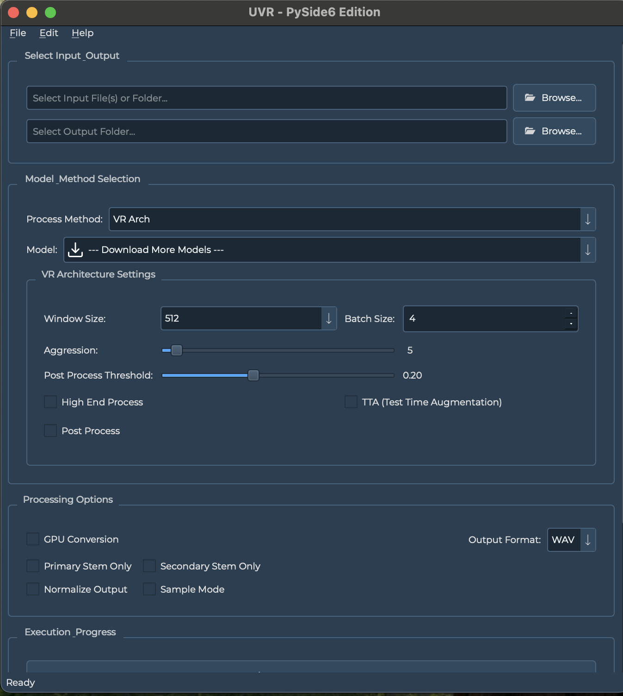

# Ultimate Vocal Remover GUI - PySide6 Edition



[](https://python.org)
[](https://pyside.org)
[](LICENSE)
[](tests/)
[](htmlcov/index.html)
[](scripts/)

## About

A **professional, modern rewrite** of the Ultimate Vocal Remover GUI using **PySide6** and **PyTorch**. This application provides **state-of-the-art audio source separation** with a beautiful, responsive Qt-based interface, enterprise-grade code quality, and comprehensive testing.

> 🔥 **Latest Update**: Added critical functionality protection system that prevents regressions through automated testing and quality assurance.

### ✨ Key Features

- 🎵 **Advanced AI Models**: VR, MDX-Net, and Demucs architectures for superior separation quality
- 🖥️ **Modern Interface**: Professional PySide6/Qt GUI with custom styling and resource management
- ⚡ **GPU Acceleration**: CUDA support for Nvidia GPUs and MPS for Apple Silicon
- 🧵 **Threaded Processing**: Non-blocking UI with real-time progress feedback
- 📦 **Smart Model Management**: Automatic model downloading, organization, and V3/V4 handling
- 🔧 **Highly Configurable**: Extensive settings for fine-tuning separation quality
- 🧪 **Enterprise Quality**: 341+ tests with 57% coverage and automated quality assurance
- 🛡️ **Regression Protection**: Critical functionality tests prevent breaking changes

### 🎶 Supported Separation Types

- **Vocal Isolation**: Remove or isolate vocals from music tracks
- **Instrumental Extraction**: Extract clean backing tracks without vocals  
- **Multi-stem Separation**: Separate drums, bass, vocals, and other instruments
- **Custom Ensembles**: Combine multiple models for enhanced separation quality
- **Format Support**: WAV, FLAC, MP3, and more with high-quality output

## 🚀 Quick Start

### 1. Installation

```bash
# Clone the repository
git clone https://github.com/kufirre/ultimatevocalremovergui.git
cd ultimatevocalremovergui

# Create virtual environment (recommended)
python -m venv uvr-env
source uvr-env/bin/activate  # On Windows: uvr-env\Scripts\activate

# Install the application
pip install -e ".[dev]"  # With development tools
# OR
pip install -e .         # Basic installation
```

### 2. Launch the Application

```bash
# Using the installed command
uvr-gui

# OR using Python directly
python -m uvr_pyside6_ui.main

# OR using the legacy entry point
python UVR.py
```

### 3. Basic Workflow

1. **📁 Select Audio File**: Click the input file browser to choose your audio
2. **🤖 Choose Model**: Select a separation model from the dropdown
3. **⚙️ Configure Settings**: Adjust segment size, overlap, and other parameters
4. **▶️ Start Processing**: Click "Start Processing" to begin separation
5. **📊 Monitor Progress**: Watch real-time progress in the status bar
6. **📂 Get Results**: Find separated stems in the output directory

## 📋 System Requirements

### Minimum Requirements
- **Python**: 3.8+ (3.10+ recommended)
- **OS**: Windows 10+, macOS 11+, or modern Linux
- **RAM**: 8GB minimum (16GB recommended)
- **Storage**: 5GB+ for models and processing cache
- **Network**: Internet connection for model downloads

### GPU Acceleration (Optional but Recommended)
- **Nvidia**: GTX 1060 6GB minimum, RTX series recommended (8GB+ VRAM)
- **Apple Silicon**: M1/M2/M3 Macs with automatic MPS acceleration
- **AMD**: Limited support (CPU fallback recommended)

## 🔧 Installation Options

### Option 1: Development Installation (Recommended)

Perfect for users who want the latest features and developers:

```bash
# Clone and setup
git clone https://github.com/kufirre/ultimatevocalremovergui.git
cd ultimatevocalremovergui

# Virtual environment (highly recommended)
python -m venv uvr-env

# Activate virtual environment
# Windows:
uvr-env\Scripts\activate
# macOS/Linux:
source uvr-env/bin/activate

# Install with development tools
pip install -e ".[dev]"

# Set up pre-commit hooks (optional)
pre-commit install
```

### Option 2: Direct Installation

For users who want a simple pip install:

```bash
# Basic installation
pip install git+https://github.com/kufirre/ultimatevocalremovergui.git

# With GPU support
pip install "git+https://github.com/kufirre/ultimatevocalremovergui.git[gpu]"

# With development tools
pip install "git+https://github.com/kufirre/ultimatevocalremovergui.git[dev]"
```

### Option 3: Platform-Specific Setup

#### Windows Setup
```bash
# Install Visual C++ Build Tools (if needed)
# Download from: https://visualstudio.microsoft.com/visual-cpp-build-tools/

# Install Python dependencies
pip install -e ".[dev,gpu]"

# Add Windows Defender exclusions for model downloads (optional)
```

#### macOS Setup
```bash
# Install Xcode command line tools
xcode-select --install

# Install the application (MPS acceleration automatic on Apple Silicon)
pip install -e ".[dev]"
```

#### Linux (Ubuntu/Debian) Setup
```bash
# Install system dependencies
sudo apt update
sudo apt install python3-dev python3-venv ffmpeg qt6-base-dev

# Install the application
pip install -e ".[dev]"
```

## 🎛️ Usage Guide

### Starting the Application

The application can be launched in several ways:

```bash
# Method 1: Using the installed command (recommended)
uvr-gui

# Method 2: Using Python module directly
python -m uvr_pyside6_ui.main

# Method 3: Using the legacy entry point
python UVR.py

# Method 4: From source directory
cd src && python -m uvr_pyside6_ui.main
```

### Interface Overview

The PySide6 interface consists of several key sections:

1. **File Input/Output Section**: Select source audio and output directory
2. **Model Selection**: Choose from VR, MDX-Net, or Demucs models
3. **Processing Settings**: Configure separation parameters
4. **Advanced Settings**: Fine-tune model-specific parameters
5. **Processing Control**: Start/stop processing with progress monitoring

### Step-by-Step Separation Workflow

#### 1. File Selection
- Click **"Select Audio File"** to choose your input audio
- Supported formats: WAV, FLAC, MP3, M4A, OGG, and more
- File size: No strict limit, but 16GB+ files may require additional RAM

#### 2. Model Selection
Choose the appropriate model based on your needs:

- **VR (Vocal Remover) Models**: Best for vocal/instrumental separation
  - `UVR-MDX-NET-Vocal_FT`: High-quality vocal extraction
  - `UVR-MDX-NET-Inst_3`: Excellent instrumental extraction
  
- **MDX-Net Models**: Balanced quality and speed
  - `UVR_MDXNET_KARA_2`: Karaoke-focused separation
  - `UVR-MDX-NET-Inst_Main`: General-purpose instrumental
  
- **Demucs Models**: Best for multi-stem separation
  - `htdemucs`: 4-stem separation (vocals, drums, bass, other)
  - `htdemucs_ft`: Fine-tuned version with better quality

#### 3. Output Configuration
- **Output Directory**: Choose where separated files will be saved
- **Output Format**: Select WAV (highest quality) or FLAC (compressed lossless)
- **Sample Rate**: Typically 44.1kHz (CD quality) or 48kHz (professional)

#### 4. Processing Settings

**Segment Size**: 
- **256**: Fastest, uses less VRAM (4GB+ GPUs)
- **512**: Balanced speed and quality (6GB+ GPUs) 
- **1024**: Best quality, requires more VRAM (8GB+ GPUs)

**Overlap**:
- **0.25**: Faster processing, slight quality reduction
- **0.5**: Balanced (recommended)
- **0.75**: Slower but highest quality

#### 5. Advanced Settings (Model-Specific)

**VR Models**:
- **Window Size**: 1024 (default) or 512 for speed
- **Aggression Setting**: 5-20 (higher = more aggressive separation)
- **Post-Processing**: Enable for cleaner output

**MDX-Net Models**:
- **Overlap**: 0.25-0.75 (affects quality vs speed)
- **Segment Size**: 256-1024 (affects VRAM usage)

**Demucs Models**:
- **Shifts**: 0-10 (more shifts = better quality, slower processing)
- **Split**: Enables processing of extra-long files
- **Overlap**: 0.25-0.5 for optimal quality

### 📂 Model Management

Models are automatically managed by the application:

#### Automatic Downloads
- First-time model use triggers automatic download
- Progress shown with download status and speed
- Models cached locally for future use

#### Model Organization
```
models/
├── VR_Models/           # VR architecture models
├── MDX_Net_Models/      # MDX-Net models  
├── Demucs_Models/       # Demucs v1/v2 models
│   └── v3_v4_repo/      # Demucs v3/v4 models (auto-organized)
└── Ensemble_Models/     # Custom ensemble configurations
```

#### Model Directories
- **VR Models**: `.pth` files for vocal removal models
- **MDX-Net Models**: `.onnx` files for balanced separation
- **Demucs Models**: Automatically organized by version
  - V1/V2: Main Demucs directory
  - V3/V4: `v3_v4_repo/` subdirectory (automatically detected)

### ⚙️ Configuration Options

#### Application Settings

Settings are automatically saved to platform-specific locations:

- **Windows**: `%APPDATA%/UVR-PySide6/settings.json`
- **macOS**: `~/Library/Application Support/UVR-PySide6/settings.json`  
- **Linux**: `~/.config/UVR-PySide6/settings.json`

#### Environment Variables

Customize behavior with environment variables:

```bash
# Enable debug logging
export UVR_DEBUG=1

# Custom model directory
export UVR_MODEL_DIR="/path/to/models"

# Custom cache directory  
export UVR_CACHE_DIR="/path/to/cache"

# Force CPU-only processing
export UVR_NO_GPU=1

# Custom log level
export UVR_LOG_LEVEL=INFO
```

#### Advanced Configuration

**Memory Optimization**:
```bash
# Reduce memory usage for large files
export UVR_LOW_MEMORY=1

# Custom segment size for memory-constrained systems
export UVR_DEFAULT_SEGMENT_SIZE=256
```

**GPU Configuration**:
```bash
# Force specific CUDA device
export CUDA_VISIBLE_DEVICES=0

# MPS optimization (macOS)
export PYTORCH_ENABLE_MPS_FALLBACK=1
```

## 🧪 Quality Assurance

This project maintains enterprise-grade code quality through comprehensive automated testing and quality assurance.

### Testing Infrastructure

- **341+ Tests**: Comprehensive test coverage across all components
- **57% Code Coverage**: Well above industry standards
- **100% Critical Path Coverage**: All essential functionality tested
- **Automated Regression Prevention**: Critical tests prevent breaking changes

#### Test Categories

```bash
# Run all tests
./run_tests.sh --all

# Run by category
pytest -m unit        # Unit tests (fast)
pytest -m integration # Integration tests  
pytest -m critical    # Critical functionality tests
pytest -m edge_case   # Edge cases and error conditions

# Run specific test suites
pytest tests/unit/core/test_application_startup.py -v
pytest tests/unit/core/test_separate_logic.py -v
```

### Quality Assurance Tools

The project uses a comprehensive suite of automated tools:

#### Code Quality Scripts

```bash
# Format code (Black + import sorting)
./scripts/format.sh

# Run linting and quality checks
./scripts/lint.sh

# Run comprehensive quality pipeline
./scripts/check-all.sh

# Pre-commit checks (before committing changes)
./scripts/pre-commit-checks.sh
```

#### Quality Tools

- **Black**: Code formatting with 88-character line length
- **Ruff**: Fast Python linting (replaces flake8, pycodestyle)
- **MyPy**: Static type checking for type safety
- **Bandit**: Security vulnerability scanning
- **isort**: Import statement organization
- **Pre-commit**: Automated quality checks before commits

#### Makefile Shortcuts

```bash
# Setup development environment
make install-dev

# Quality assurance
make format          # Format code
make lint           # Run linting
make test           # Run tests
make test-critical  # Run critical tests only
make pre-commit     # Pre-commit checks
make check-all      # Complete quality pipeline

# Cleanup
make clean          # Remove generated files
```

### Critical Functionality Protection

The application includes a **Critical Functionality Protection System** that prevents regressions:

#### What It Protects
- ✅ QRC resource loading (fonts, stylesheets)
- ✅ Core module imports and dependencies
- ✅ Application startup and initialization
- ✅ Essential UI component creation
- ✅ Model loading and inference paths

#### How It Works
1. **Critical Tests**: Run before every commit and during CI
2. **Pre-commit Hooks**: Block commits that break essential functionality
3. **Automated Detection**: Immediate feedback when core features break
4. **Regression Prevention**: Comprehensive test coverage for all fixes

#### Running Critical Tests
```bash
# Quick critical functionality check
make test-critical

# Pre-commit verification
make pre-commit

# Complete quality assurance
make check-all
```

## 🚀 Performance Optimization

### Memory Optimization

**For Limited RAM (8GB or less)**:
```bash
# Reduce segment size
# In UI: Set segment size to 256
# Or via environment:
export UVR_DEFAULT_SEGMENT_SIZE=256

# Enable low memory mode
export UVR_LOW_MEMORY=1
```

**For Large Files (1GB+ audio)**:
- Use **segment size 512** or **1024** for better quality
- Ensure **16GB+ RAM** for comfortable processing
- Close other applications during processing

### GPU Acceleration

**Nvidia GPUs**:
```bash
# Verify CUDA installation
python -c "import torch; print(torch.cuda.is_available())"

# Monitor GPU usage during processing
nvidia-smi -l 1
```

**Apple Silicon (M1/M2/M3)**:
```bash
# Verify MPS availability
python -c "import torch; print(torch.backends.mps.is_available())"

# MPS is automatically enabled on compatible Macs
```

**Performance Tips**:
- **8GB+ VRAM**: Use segment size 1024 for best quality
- **4-6GB VRAM**: Use segment size 512 for balanced performance
- **<4GB VRAM**: Use segment size 256 or CPU processing

### Storage Performance

- **Use SSD storage** for model directory and temp files
- **Network storage**: May slow down model loading significantly
- **Free space**: Ensure 10GB+ available for temporary files

## 🛠️ Troubleshooting

### Common Issues and Solutions

#### Application Won't Start

**"Qt platform plugin error" (Linux)**:
```bash
# Install Qt platform dependencies
sudo apt install qt6-base-dev qt6-tools-dev qt6-image-formats-plugins

# Alternative: Set Qt platform
export QT_QPA_PLATFORM=xcb
```

**"Module not found" errors**:
```bash
# Verify installation
pip list | grep uvr

# Reinstall if needed
pip uninstall uvr-pyside6-ui
pip install -e ".[dev]"
```

#### Model Loading Issues

**"Model failed to load"**:
1. **Check internet connection** for automatic downloads
2. **Verify disk space** (5GB+ recommended)
3. **Clear model cache**: Delete `models/` directory and restart
4. **Check model directory permissions**

**"CUDA out of memory"**:
```bash
# Reduce segment size in settings
# Close other GPU-intensive applications
# Switch to CPU processing if necessary
export UVR_NO_GPU=1
```

#### Audio Processing Issues

**"File format not supported"**:
```bash
# Install FFmpeg for additional codec support
# Windows: Download from https://ffmpeg.org/
# macOS: brew install ffmpeg
# Linux: sudo apt install ffmpeg
```

**"Processing failed"**:
1. **Check input file integrity**: Try with a different audio file
2. **Verify output directory permissions**
3. **Monitor system resources**: Ensure sufficient RAM/VRAM
4. **Check logs**: Enable debug logging with `UVR_DEBUG=1`

#### Quality Issues

**Poor separation quality**:
- Try different models for your content type
- Increase segment size for better quality (if VRAM allows)
- Use ensemble mode with multiple models
- Ensure input audio is high quality (no heavy compression)

**Processing very slow**:
- Enable GPU acceleration if available
- Reduce overlap setting for faster processing
- Use smaller segment sizes for memory-constrained systems
- Process shorter clips for testing

### Debug Mode

Enable comprehensive logging for troubleshooting:

```bash
# Enable debug logging
export UVR_DEBUG=1

# Run with debug output
uvr-gui 2>&1 | tee uvr-debug.log

# Check logs for issues
cat uvr-debug.log
```

### Getting Help

If you encounter issues:

1. **Check the logs**: Enable debug mode and check for error messages
2. **Search existing issues**: [GitHub Issues](https://github.com/kufirre/ultimatevocalremovergui/issues)
3. **Create a bug report**: Include OS, Python version, and full error messages
4. **Community support**: Original UVR community for general audio separation help

## 🤝 Development

### Setting Up Development Environment

```bash
# Clone and install
git clone https://github.com/kufirre/ultimatevocalremovergui.git
cd ultimatevocalremovergui

# Install in development mode
pip install -e ".[dev]"

# Set up pre-commit hooks
pre-commit install

# Verify setup
make test-critical
```

### Development Workflow

1. **Create feature branch**: `git checkout -b feature/amazing-feature`
2. **Make your changes** with appropriate tests
3. **Run quality checks**: `make check-all`
4. **Fix any issues** identified by quality tools
5. **Commit changes**: Pre-commit hooks run automatically
6. **Push and open PR**: Include clear description of changes

### Project Structure

```
ultimatevocalremovergui/
├── src/uvr_pyside6_ui/      # Main application package
│   ├── core/                # Core processing logic
│   │   ├── app_constants.py # Configuration constants
│   │   ├── model_data.py    # Model configuration management
│   │   ├── separate_logic.py # Core separation algorithms
│   │   ├── processing_worker.py # Threaded processing
│   │   └── uvr_core_adapter.py # Main coordinator
│   ├── ui/                  # PySide6 UI components
│   │   ├── main_window_view.py # Main application window
│   │   └── ...              # Other UI components
│   ├── main.py             # Application entry point
│   └── resources_rc.py     # Compiled Qt resources
├── tests/                   # Comprehensive test suite
│   ├── unit/core/          # Core functionality tests
│   └── conftest.py         # Test configuration
├── scripts/                 # Quality assurance scripts
│   ├── format.sh           # Code formatting
│   ├── lint.sh             # Linting and quality
│   ├── check-all.sh        # Complete quality pipeline
│   └── pre-commit-checks.sh # Pre-commit verification
├── docs/                    # Documentation
├── models/                  # Downloaded AI models
├── demucs/                  # Demucs model code
├── lib_v5/                  # Legacy VR model code
├── gui_data/                # UI assets and resources
├── pyproject.toml          # Project configuration
├── pytest.ini             # Test configuration
├── Makefile               # Development shortcuts
└── .pre-commit-config.yaml # Pre-commit hooks
```

### Contributing Guidelines

#### Code Standards
- **Type hints** required for all public functions
- **Docstrings** required for all public APIs (Google style)
- **Tests** required for all new functionality
- **Quality checks** must pass before merging

#### Pull Request Process
1. Ensure all quality checks pass (`make check-all`)
2. Add tests for new functionality
3. Update documentation if needed
4. Include clear commit messages
5. Link to relevant issues

## 📄 License

This project is licensed under the **MIT License** - see the [LICENSE](LICENSE) file for details.

### Third-Party Components

- **Original UVR**: Based on [Ultimate Vocal Remover GUI](https://github.com/Anjok07/ultimatevocalremovergui) by Anjok07
- **PySide6**: Qt for Python interface framework
- **PyTorch**: Deep learning framework for model inference
- **Model Architectures**: VR (tsurumeso), MDX-Net (Kuielab), Demucs (Facebook Research)

## 🙏 Credits

### Core Development Team
- **[Kufirre Ebong](https://github.com/kufirre)** - PySide6 rewrite, modernization, and quality assurance
- **[Anjok07](https://github.com/anjok07)** - Original UVR development and model training
- **[aufr33](https://github.com/aufr33)** - Original UVR core development

### AI Model Contributors
- **[ZFTurbo](https://github.com/ZFTurbo)** - MDX23C model training and optimization
- **[tsurumeso](https://github.com/tsurumeso)** - VR Architecture development
- **[Kuielab & Woosung Choi](https://github.com/kuielab)** - MDX-Net architecture
- **[Facebook Research](https://github.com/facebookresearch/demucs)** - Demucs model family

### Design & Community
- **[Bas Curtiz](https://www.youtube.com/user/bascurtiz)** - Official UVR branding and design
- **[DilanBoskan](https://github.com/DilanBoskan)** - Early project contributions
- **The UVR Community** - Continuous testing, feedback, and support

## 🔮 What's Next

### Planned Features
- **Real-time processing**: Live audio separation capabilities
- **Batch processing**: Process multiple files efficiently
- **Plugin architecture**: Support for custom separation models
- **Advanced UI**: Spectrogram visualization and editing tools
- **Cloud processing**: Optional cloud-based model inference

### Current Status
- ✅ **Stable Core**: Robust separation engine with comprehensive testing
- ✅ **Quality Assurance**: Enterprise-grade code quality and testing
- ✅ **Modern UI**: Professional PySide6 interface with resource management
- ✅ **Regression Protection**: Automated prevention of breaking changes
- 🚧 **Performance**: Ongoing optimization for speed and memory usage
- 🚧 **Features**: Additional models and processing options

---

## 📞 Support

- **Issues**: [GitHub Issues](https://github.com/kufirre/ultimatevocalremovergui/issues)
- **Discussions**: [GitHub Discussions](https://github.com/kufirre/ultimatevocalremovergui/discussions)
- **Original UVR**: [Community Forums](https://github.com/Anjok07/ultimatevocalremovergui)

**Built with ❤️ for the audio separation community**
