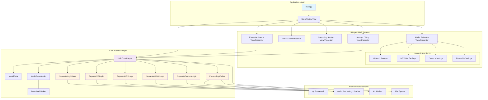
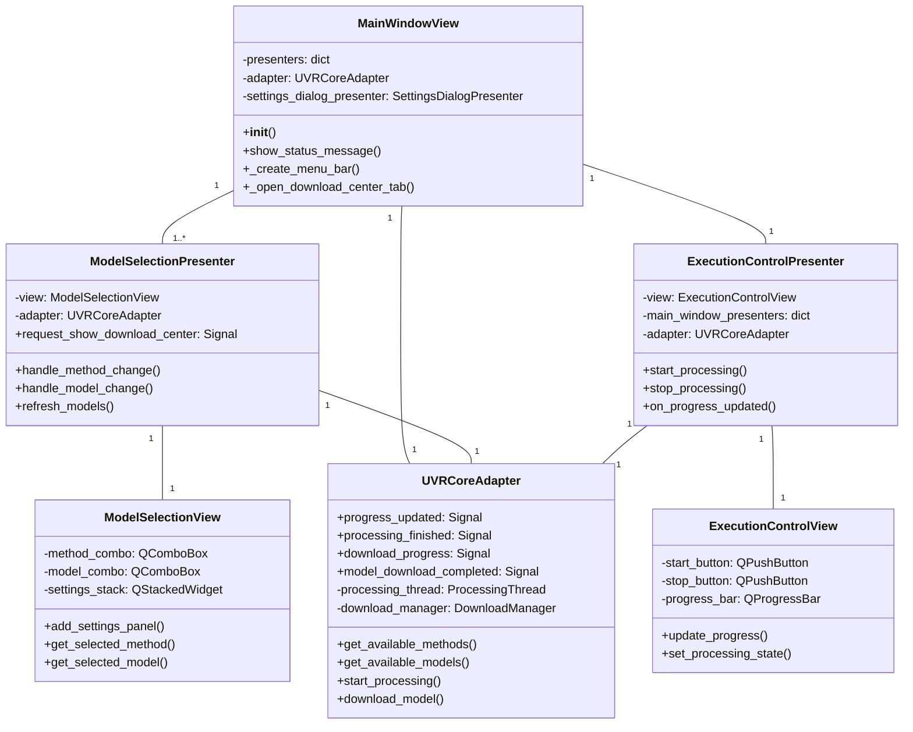
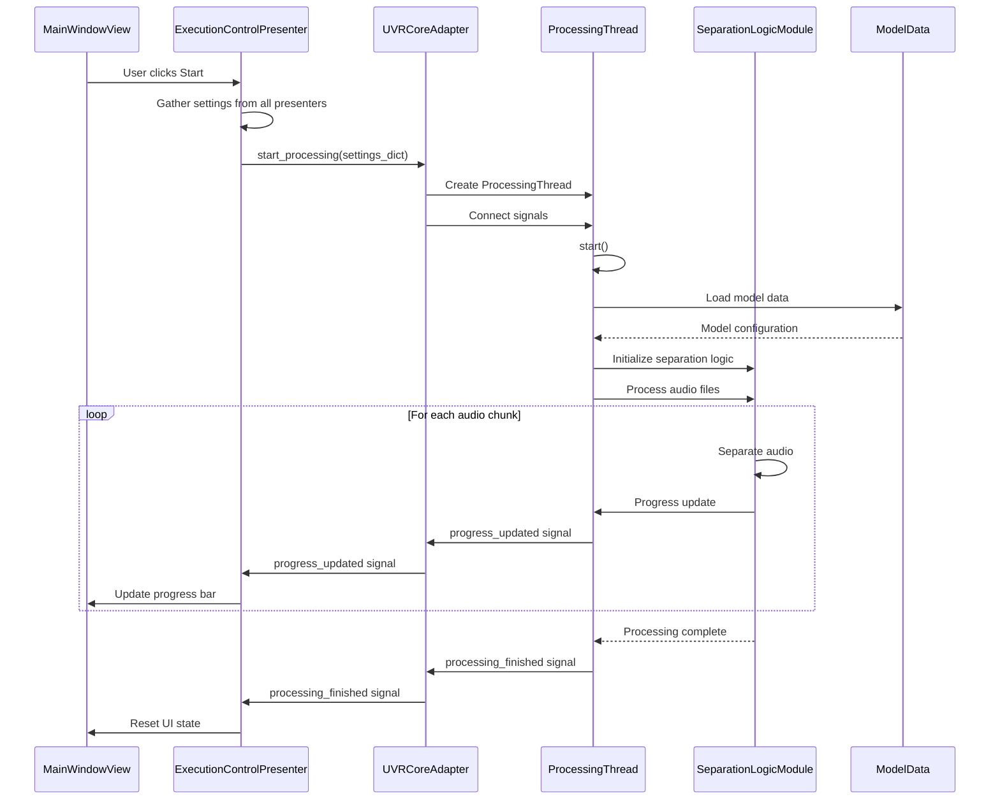
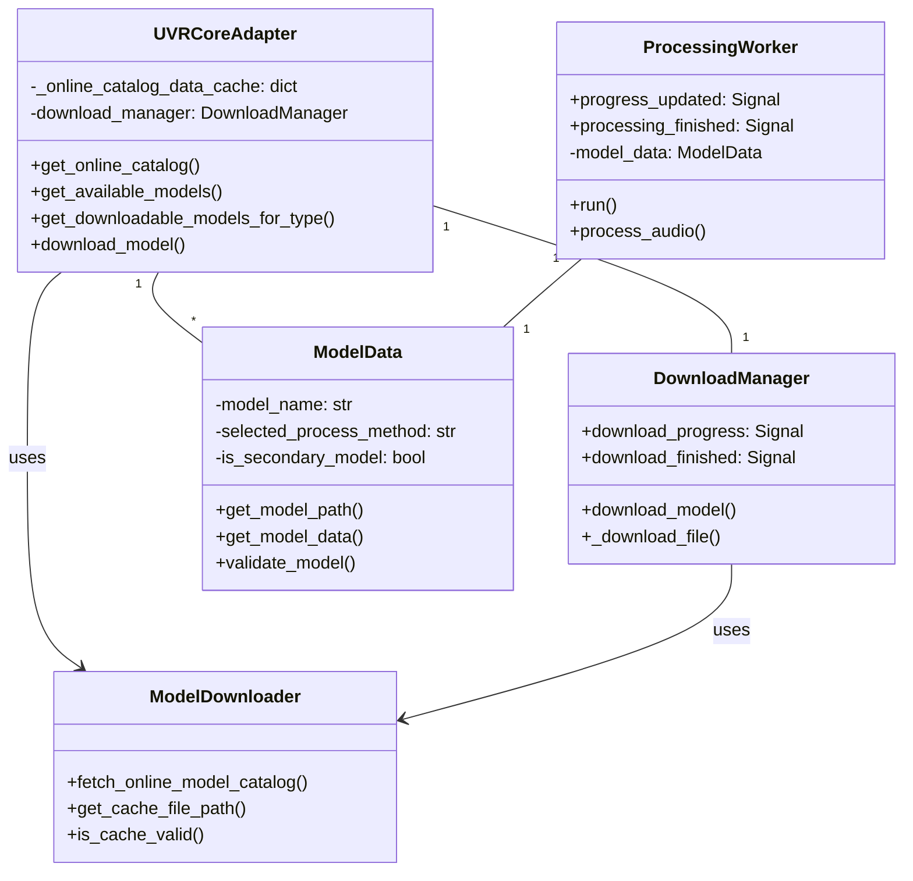
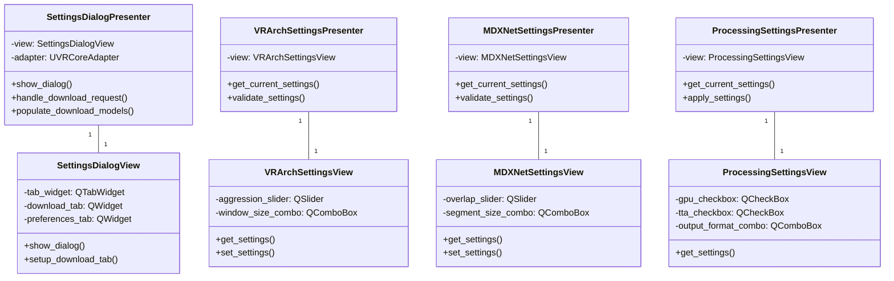
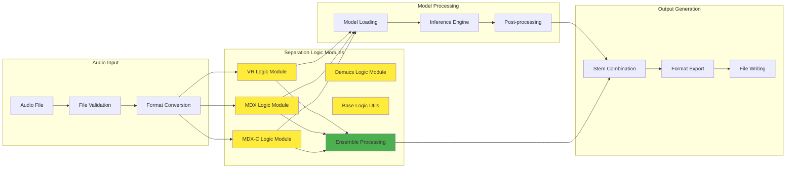
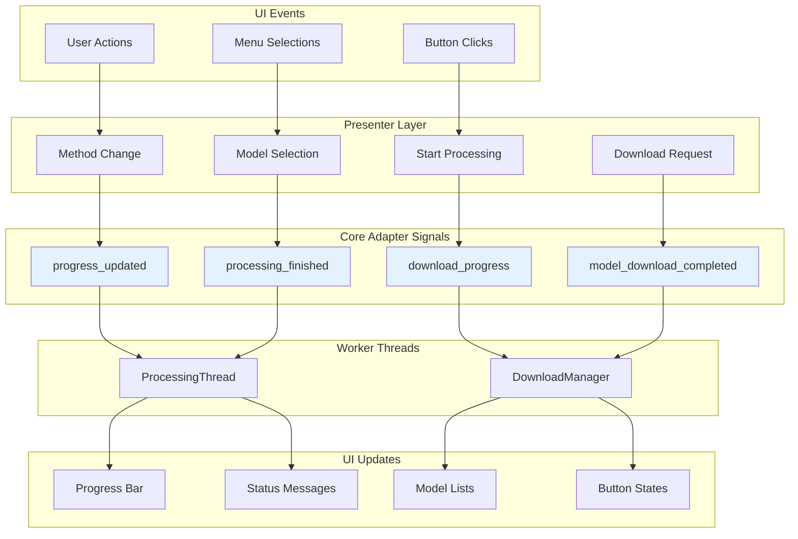

# UVR PySide6 Architecture Diagrams

This document contains UML diagrams that illustrate the architecture and interactions within the UVR PySide6 application.

## 1. Overall System Architecture

## 2. MVP (Model-View-Presenter) Pattern Implementation

## 3. Core Processing Pipeline

## 4. Model Management System

## 5. Settings and Configuration Management

## 6. Audio Processing Components

## 7. Signal/Slot Communication Pattern

## Key Architecture Principles

### 1. **MVP Pattern**
- **Views**: Pure UI components (Qt widgets)
- **Presenters**: Business logic and event handling
- **Model**: Core adapter and data classes

### 2. **Signal-Slot Communication**
- Loose coupling between components
- Thread-safe communication
- Event-driven architecture

### 3. **Separation of Concerns**
- UI logic separate from business logic
- Processing logic isolated in worker threads
- Model management centralized in adapter

### 4. **Thread Safety**
- Heavy processing in worker threads
- Qt signals for cross-thread communication
- Progress updates via signal/slot mechanism

### 5. **Modular Design**
- Method-specific settings components
- Pluggable audio processing backends
- Extensible model support

## Component Responsibilities

| Component | Responsibility |
|-----------|---------------|
| `main.py` | Application entry point, resource loading |
| `MainWindowView` | Main UI container, menu management |
| `UVRCoreAdapter` | Central business logic coordinator |
| `ProcessingWorker` | Audio processing in separate thread |
| `ModelData` | Model configuration and validation |
| **Separation Logic Modules** | **Modular audio separation implementations** |
| `SeparateLogicBase` | Common utilities and base separator class |
| `SeparateVRLogic` | VR architecture audio separation |
| `SeparateMDXLogic` | MDX-Net ONNX model processing |
| `SeparateMDXCLogic` | MDX-C checkpoint model processing |
| `SeparateDemucsLogic` | Demucs v1/v2/v3/v4 processing |
| `DownloadManager` | Model download functionality |
| `Settings Views/Presenters` | Method-specific configuration UI |

This architecture provides a clean, maintainable, and extensible foundation for the UVR PySide6 application. 