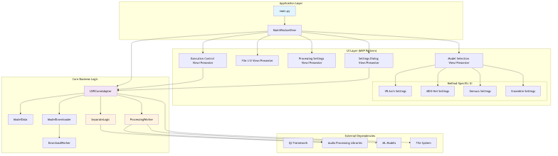
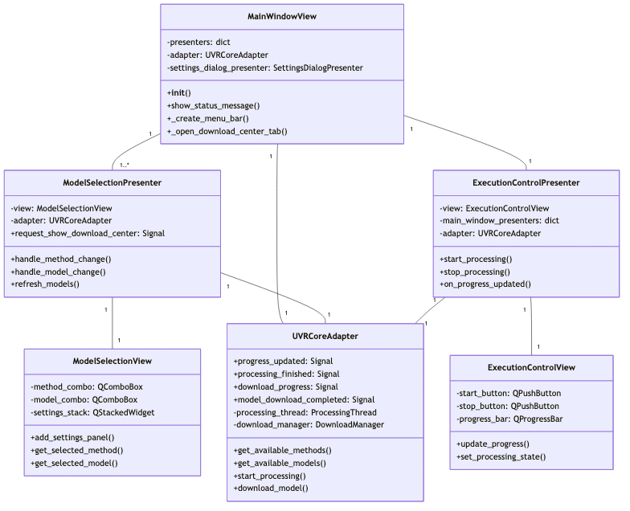
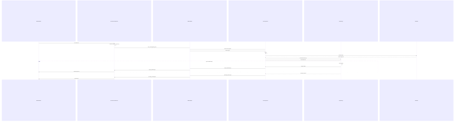
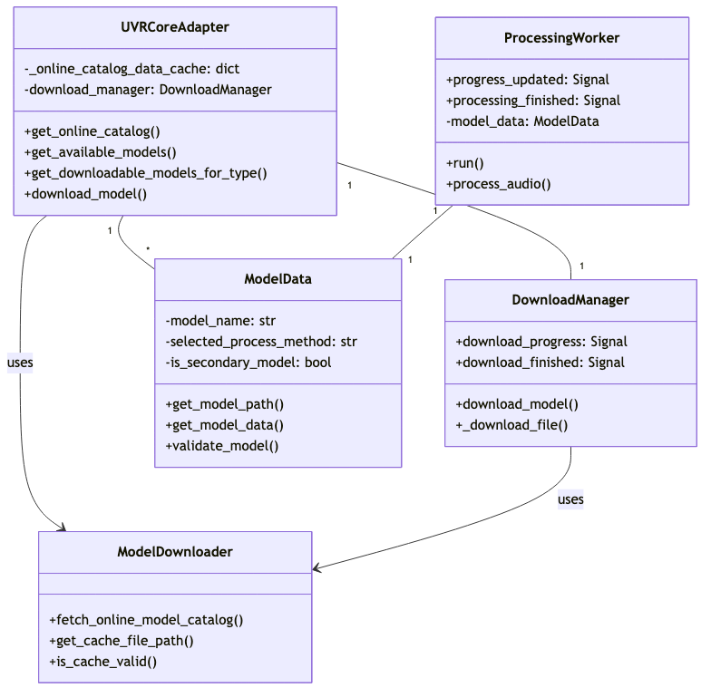
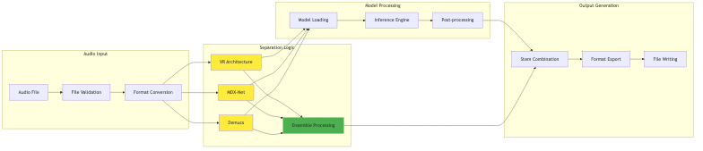
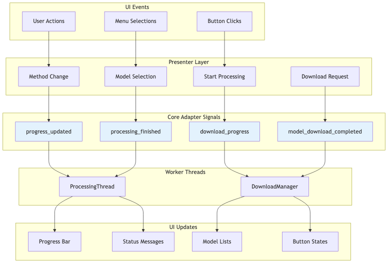

# UVR PySide6 Architecture Diagrams

This directory contains auto-generated diagrams from the architecture documentation.

## Available Diagrams

### 1. System Architecture


### 2. MVP Pattern Implementation


### 3. Processing Pipeline


### 4. Model Management System


### 5. Audio Processing Components


### 6. Signal/Slot Communication


## File Formats

- **PNG**: High-resolution images (1920x1080)
- **SVG**: Vector graphics (scalable)
- **Thumbnails**: Smaller versions (800x600) for previews

## Regenerating Diagrams

To regenerate these diagrams:

```bash
# Install Mermaid CLI (if not already installed)
npm install -g @mermaid-js/mermaid-cli

# Run the generation script
./scripts/generate_diagrams.sh
```

## Source

All diagrams are generated from the Mermaid code in `docs/architecture_diagrams.md`.
